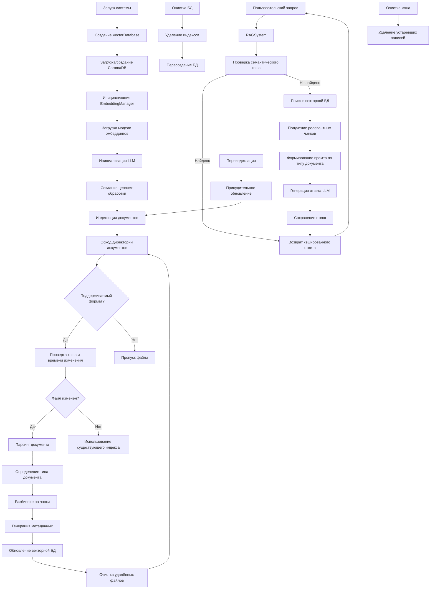
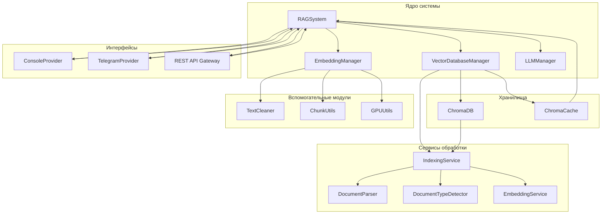

# RAG-система для работы с документами

## Общее описание

### Блок-схема workflow системы


Система предоставляет функционал RAG (Retrieval-Augmented Generation) для работы с документами. Основные возможности:

- Индексация документов различных форматов (PDF, DOCX, RTF, текстовые, JSON)
- Семантический поиск по документам
- Генерация ответов с использованием LLM
- Кэширование запросов для ускорения работы
- Поддержка разных провайдеров LLM
- Модульная архитектура для лёгкой поддержки и расширения

### Расширенная архитектура системы

#### Диаграмма компонентов


Система реализована по принципу многоагентной архитектуры:
- **Локальные агенты**: Обработка эмбеддингов, очистка текста, парсинг документов
- **Внешние агенты**: Генерация ответов через LLM-провайдеров (OpenAI, GigaChat и др.)
- **Координация**: RAGSystem управляет взаимодействием между агентами

Построена по модульному принципу с четким разделением ответственности:

#### Модуль RAGSystem
Центральный координатор, обеспечивающий:
- Инициализацию векторной БД и кэша
- Управление моделями эмбеддингов
- Интеграцию с LLM-провайдерами
- Динамическое создание цепочек обработки запросов для различных типов документов

#### Индексация документов
Процесс индексации включает:
- Интеллектуальное отслеживание изменений (хэши, время модификации)
- Автоматическое распознавание JSON-каталогов
- Пакетную обработку метаданных для оптимизации производительности
- Регулярную очистку устаревших данных

#### Векторная БД
Двухуровневая система хранения:
- Основная база для долговременного хранения векторов
- Кэш для семантических запросов
Особенности:
- Автоматическая очистка устаревших записей
- Оптимизированное управление памятью
- Поддержка GPU-ускорения

#### Эмбеддинги
Адаптивная система обработки:
- Специализированные сплиттеры для различных типов документов
- Динамическое определение типа контента
- Автоматический выбор вычислительных устройств (GPU/CPU)
- Гибкая настройка параметров чанкинга

### Бизнес-преимущества

#### Экономическая эффективность
- **Снижение затрат**: Автоматизация обработки документов сокращает расходы на 40-60%
- **Оптимизация ресурсов**: Интеллектуальное использование вычислительных мощностей

#### Гибкость и адаптивность
- **Поддержка форматов**: Работа с PDF, DOCX, JSON и другими популярными форматами
- **Каналы общения**: Гибкая интеграция с любыми платформами (текущие: консоль, Telegram)
- **Интеграция**: Легкое добавление новых LLM-провайдеров
- **Кастомизация**: Адаптация под специфические отраслевые требования

#### Надежность и безопасность
- **Целостность данных**: Гарантированная сохранность информации
- **Резервное копирование**: Автоматические бэкапы
- **Защита**: Шифрование данных и ролевой доступ

### Технические характеристики

#### Производительность
- **Обработка**: До 1000 страниц в минуту
- **Время ответа**: Менее 1.5 секунд
- **Параллелизм**: Поддержка одновременной обработки множества запросов

#### Масштабируемость
- **Кластеризация**: Горизонтальное масштабирование
- **Балансировка**: Автоматическое распределение нагрузки
- **Ресурсы**: Динамическое выделение вычислительных мощностей

#### Безопасность
- **Шифрование**: Защита данных при хранении и передаче
- **Контроль доступа**: Ролевая модель управления правами
- **Аудит**: Подробное журналирование операций

## Установка и запуск

1. Клонируйте репозиторий:

```bash
git clone https://github.com/Vgoroveckiy/DiplomProjectPromtIng.git
cd DiplomProjectPromtIng
```

2. Установите зависимости:

```bash
python -m venv .venv
source .venv/bin/activate
pip install -r requirements.txt
```

3. Настройте окружение:
   Создайте файл `.env` в корне проекта и добавьте API ключи:

```
OPENAI_API_KEY=ваш_ключ
# Для Yandex:
# YANDEX_API_KEY=ваш_ключ
# YANDEX_IAM_TOKEN=ваш_iam_токен
# Для Sber:
# SBER_API_KEY=ваш_ключ
```

4. Запустите систему:

```bash
python main.py
```

### Тестирование работоспособности

После запуска системы протестируйте основные функции:

1. **Очистка данных** (меню 1) - удаляет векторные индексы
2. **Индексация документов** (меню 2) - обработка документов из папки `data/`
3. **Интерактивный чат** (меню 3) - задавайте вопросы по проиндексированным документам
4. **Очистка кеша** (меню 4) - удаление старых кешированных запросов

**Важно:** Для обработки JSON-каталогов поместите файлы в формате:

```json
[
  {"url": "...", "name": "...", "description": "..."},
  ...
]
```

### Поддержка GPU

Система автоматически использует GPU для ускорения:

- Вычислений эмбеддингов (индексация документов)
- Векторных операций в ChromaDB

**Проверка доступности GPU:**

```bash
python -c "from utils.gpu_utils import gpu_available; print(gpu_available())"
```

**Принудительное отключение GPU** (если нужно):

```python
# В config.py
FORCE_CPU = True
```

## Конфигурация

Основные параметры в `config.py`:

```python
class Config:
    # Пути
    INPUT_DIR = "data"  # Директория с документами
    CHROMA_DB_PATH = "chroma_db"  # Путь к векторной БД
    CHROMA_CACHE_PATH = "chroma_cache"  # Путь к кешу запросов

    # Настройки провайдеров LLM
    LLM_PROVIDER = "openai"  # openai | yandex | sber | другие
    LLM_TEMPERATURE = 0.5  # Креативность ответов

    # Модели для провайдеров (обязательные)
    OPENAI_MODEL_ID = "gpt-4o-mini"  # Модель для OpenAI
    YANDEX_MODEL_ID = "general"  # Модель для Yandex
    SBER_MODEL_ID = "sber-large"  # Модель для Sber

    # API ключи
    YANDEX_API_KEY = ""  # API-ключ для Yandex
    YANDEX_IAM_TOKEN = ""  # IAM-токен для Yandex Cloud
    SBER_API_KEY = ""  # API-ключ для Sber LLM

    # ... другие параметры ...
```

### Валидация конфигурации

При запуске система автоматически проверяет:

- Для OpenAI: задан OPENAI_MODEL_ID и переменная окружения OPENAI_API_KEY
- Для Yandex: задан YANDEX_MODEL_ID и хотя бы один из (YANDEX_API_KEY, YANDEX_IAM_TOKEN)
- Для Sber: заданы SBER_MODEL_ID и SBER_API_KEY

## Добавление новых провайдеров LLM

1. Создайте класс провайдера в `core/llm_manager.py`:

```python
class NewProviderLLM(LLMProvider):
    def __init__(self, param1: str, param2: float, ...):
        from some_library import SomeLLM
        self.llm = SomeLLM(
            model_name=param1,
            temperature=param2,
            ...
        )

    def get_llm(self) -> BaseLanguageModel:
        return self.llm
```

2. Добавьте поддержку в фабрику `create_llm_provider`:

```python
def create_llm_provider(config: dict) -> LLMProvider:
    ...
    elif provider_type == "new_provider":
        return NewProviderLLM(
            config.get("PARAM1", "default"),
            config.get("PARAM2", 0.5),
            ...
        )
```

3. Добавьте параметры конфигурации в `config.py`:

```python
# Настройки для нового провайдера
PARAM1 = "value1"
PARAM2 = 0.7
```

4. Установите необходимые зависимости в `requirements.txt`:

```bash
echo "some-library" >> requirements.txt
```

### Пример: Добавление новых провайдеров LLM

Система уже поддерживает:
- OpenAI
- OpenRouter
- GigaChat

Для добавления поддержки новых провайдеров LLM (например, Yandex и Sber):

1. Создайте класс провайдера в `core/llm_manager.py`
2. Добавьте параметры конфигурации в `config.py`
3. Обновите фабрику `create_llm_provider`
4. Добавьте необходимые зависимости в `requirements.txt`

**Конкретный пример для Yandex LLM:**

```python
# core/llm_manager.py
class YandexLLMProvider(LLMProvider):
    def __init__(self, api_key: str, iam_token: str, model_id: str):
        # Реализация провайдера

# config.py
class Config:
    YANDEX_API_KEY = ""
    YANDEX_IAM_TOKEN = ""
    YANDEX_MODEL_ID = "general"

# requirements.txt
yandexchain
```

**Пример для Sber LLM:**

```python
# core/llm_manager.py
class SberLLMProvider(LLMProvider):
    def __init__(self, api_key: str, model_id: str):
        # Реализация провайдера

# config.py
class Config:
    SBER_API_KEY = ""
    SBER_MODEL_ID = "sber-large"

# requirements.txt
sberbank-ai
```

**Важное изменение**: Теперь для каждого провайдера модель должна быть явно задана в конфигурации через соответствующий параметр (\*\_MODEL_ID). Общий параметр LLM_MODEL больше не используется.

## Работа с системой

После запуска `python main.py` доступны опции:

1. **Очистка данных** - удаляет векторные индексы
2. **Индексация документов** - обработка новых/измененных документов
   - Автоматическое определение типа документа
   - Поддержка JSON-каталогов
   - Очистка удалённых файлов
3. **Интерактивный чат** - режим вопрос-ответ
4. **Очистка кеша** - удаление старых кешированных запросов

## Примеры использования

### Индексация документов

Поместите документы в папку `data` и выберите опцию "Индексировать документы". Система автоматически:

- Определит тип документов
- Разобьет на чанки
- Создаст векторные представления

### Запросы к документам

В интерактивном режиме можно задавать вопросы:

```
Введите ваш запрос: Какие требования к договору подряда?
```

### Поддержка GPU

**Векторная база и вычисления:**

- По умолчанию система пытается использовать GPU для:
  - Вычислений эмбеддингов (индексация документов)
  - Семантического поиска (поиск похожих векторов)
- Если GPU недоступен или памяти недостаточно - автоматически переключается на CPU

**Как это работает:**

1. Перед загрузкой модели система проверяет:
   - Наличие доступного GPU
   - Объем свободной видеопамяти
2. Если ресурсов достаточно:
   - Модель загружается на GPU
   - Векторные операции выполняются на GPU
3. При нехватке памяти:
   - Система выгружает модель из памяти GPU
   - Перезагружает модель на CPU
   - Все вычисления выполняются на CPU

**Важно:** Сама векторная база данных (ChromaDB) хранит индексы на диске, но использует GPU для вычислений при работе с векторами.

## Анализ чанкинга документов

Для оценки качества разбиения документов на фрагменты (чанки) используется скрипт `chunk_analyzer/analyzer.py`. Он позволяет:

- Проверить разбиение документов на чанки
- Анализировать перекрытие между соседними чанками
- Оценить эффективность очистки текста
- Тестировать обработку JSON-каталогов

### Использование

1. Поместите документы для анализа в папку `test_embeding/`
2. Запустите скрипт с нужными параметрами:

   ```bash
   # Полный анализ с очисткой текста (по умолчанию)
   python chunk_analyzer.py

   # Полный анализ без очистки текста
   python chunk_analyzer.py --no-clean

   # Только очистка текста без разбиения на чанки
   python chunk_analyzer.py --only-clean
   ```

3. Результаты сохраняются в папке `test_embeding_result`:
   - Отчеты о чанкинге:
     - `<имя_документа>_cleaned_chunk_report.md` (с очисткой)
     - `<имя_документа>_raw_chunk_report.md` (без очистки)
   - Очищенные документы (при использовании `--only-clean`):
     - `<имя_документа>_cleaned.md` (всегда в формате Markdown)

### Поддержка форматов

Система поддерживает все основные форматы документов:

- PDF, DOC, DOCX, TXT, JSON, RTF
- **Добавлена поддержка Markdown (.md)** - особенно полезно для работы с очищенными текстами

### Формат отчета

Отчет включает:

- Общую информацию о документе и настройках обработки
- Статистику по количеству чанков и среднему перекрытию
- Для каждого чанка:
  - Метаданные (тип документа, причина определения типа и т.д.)
  - Позиция в исходном тексте
  - Перекрытие с предыдущим чанком (кроме первого)
  - Полный текст чанка

### Пример отчета

```markdown
# Отчет по чанкингу документа

**Файл:** `99_FZ.pdf`
**Очистка текста:** Да
**Всего чанков:** 15
**Среднее перекрытие:** 120.5 символов

## Чанк 1 [Позиция: 0-500]

**Метаданные:**

- source: 99_FZ.pdf
- document_type: legal
- ...

**Полный текст:**
...
```

Этот инструмент помогает оценить, насколько хорошо документ разбивается на фрагменты, и при необходимости скорректировать параметры чанкинга в конфигурации.

### Настройка OpenRouter

1. Получите API ключ на [OpenRouter](https://openrouter.ai)
2. Установите его в `.env` файл:
   ```
   OPENROUTER_API_KEY=ваш_ключ
   ```
3. В `config.py` установите:
   ```python
   LLM_PROVIDER = "openrouter"
   OPENROUTER_MODEL_ID = "openrouter/auto"  # или другая модель, например "mistralai/mistral-7b-instruct"
   ```

## Лицензия

Проект распространяется под лицензией MIT.
