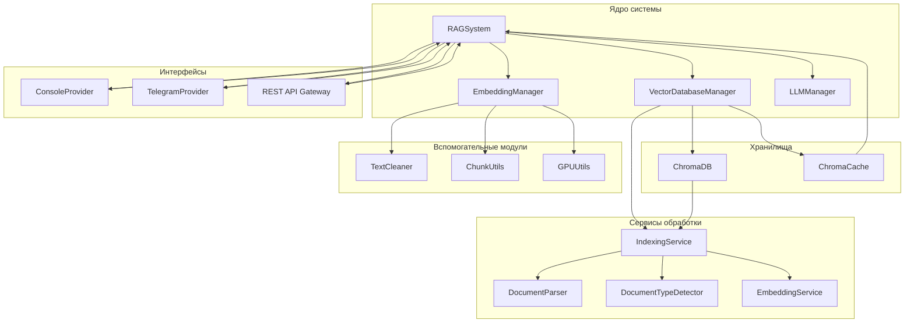
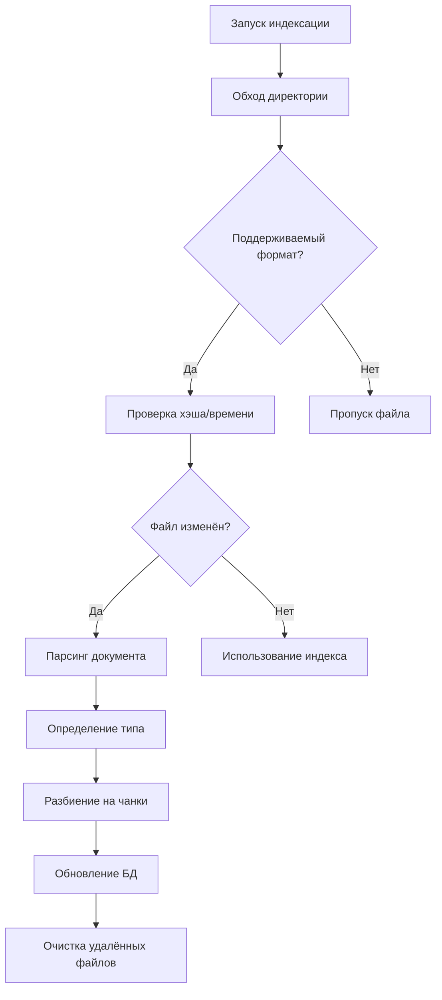
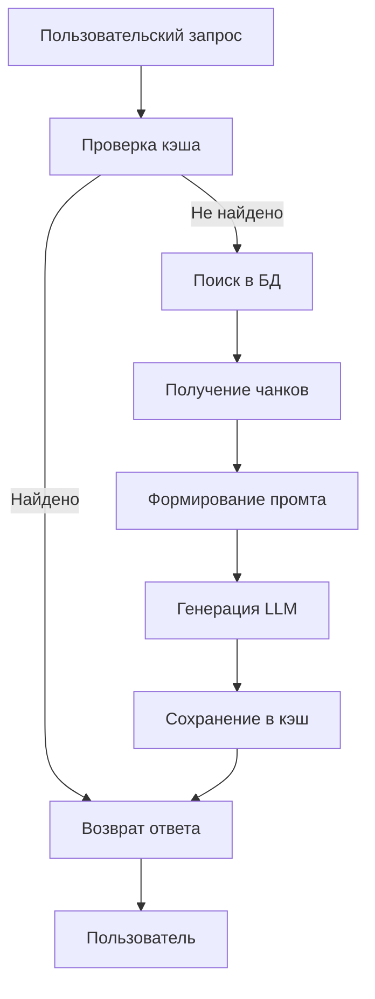

## <!--  -->

---

# Коммерческое предложение: Внедрение интеллектуальной RAG-системы «Юридический консультант»

**Дата:**
**Версия:** 1.1
**Подготовлено для:** Потенциального заказчика (юридическая фирма / компания с большим объемом документов)

---

## 1. Описание проекта

### 1.1. Цель проекта

Целью проекта является **решение проблемы ручного поиска и анализа документов** за счет внедрения универсальной интеллектуальной RAG-системы (Retrieval-Augmented Generation) для автоматизации обработки документов и предоставления консультаций на основе встроенной базы знаний. Система предназначена для работы как в качестве узкоспециализированного помощника, например, в юридической сфере, так и в качестве универсальной платформы для работы с документами любого формата и отрасли (финансы, медицина, техническая документация).

Система решает ключевые бизнес-задачи: устраняет проблему ручного поиска информации в больших объемах документов, предотвращает потерю корпоративных знаний и повышает эффективность взаимодействия с клиентами, предоставляя точные, контекстуальные ответы в режиме реального времени.

### 1.2. Ключевые преимущества для вашего бизнеса

- **Экономическая эффективность**: Сокращение затрат на обработку и анализ документов до 40–60%. Прогнозируемый ROI может составить **от 200% до 700%** в первый год эксплуатации за счет оптимизации ресурсов и повышения продуктивности.
- **Радикальное ускорение работы**: Уменьшение времени поиска необходимой информации с нескольких часов до нескольких секунд, при этом среднее время ответа системы составляет менее 1.5 секунд.
- **Высокая производительность и масштабируемость**: Способность обрабатывать до 1000 страниц документов в минуту с возможностью горизонтального масштабирования за счет кластеризации и балансировки нагрузки.
- **Гибкость и универсальность**:
  - **Многоформатность**: Поддержка всех популярных форматов документов, включая PDF, DOCX, RTF, TXT, JSON и Markdown.
  - **Многоканальность**: Взаимодействие с пользователями через Telegram-бот и консоль. Возможна простая интеграция в корпоративные порталы, CRM, ERP и другие веб-интерфейсы.
  - **Мультимодельность**: Интеграция с ведущими LLM-провайдерами (OpenAI, GigaChat, OpenRouter, Яндекс, Сбер), что позволяет выбирать оптимальную модель по соотношению стоимости и производительности.
- **Надежность и безопасность**:
  - Полная конфиденциальность данных за счет развертывания на сервере заказчика или в защищенном облаке.
  - Шифрование данных при хранении и передаче.
  - Поддержка ролевого доступа, журналирование операций и автоматическое создание резервных копий.

## 2. Функциональные и технические возможности

### 2.1. Основные функции системы

- **Интеллектуальная индексация**: Автоматическая обработка и индексация документов различных форматов. Система интеллектуально отслеживает изменения в файлах для поддержания базы знаний в актуальном состоянии.
- **Семантический поиск**: Выполнение точного поиска по смыслу запроса, а не только по ключевым словам, с использованием векторных представлений (эмбеддингов).
- **Генерация ответов и консультаций**: Создание развернутых, контекстуально точных ответов на основе найденной в документах информации, с предоставлением ссылок на источники.
- **Семантическое кэширование**: Автоматическое кэширование часто задаваемых вопросов для ускорения ответов и снижения нагрузки.

### 2.2. Административные возможности

- **Управление базой знаний**: Удобное добавление и обновление базы документов.
- **Управление пользователями**: Настройка ролевого доступа для разграничения прав.
- **Конфигурация моделей**: Возможность выбора и настройки используемых LLM-провайдеров.
- **Мониторинг и аналитика**: Контроль качества индексации и журналирование запросов для анализа работы системы.

### 2.3. Используемые технологии и архитектура

- **Основа системы**: Python.
- **Ключевые библиотеки**: LangChain, ChromaDB (векторная база данных), HuggingFace Transformers.
- **LLM-провайдеры**: Интеграция с OpenAI, GigaChat, OpenRouter, с возможностью расширения на Яндекс и Сбер.
- **Архитектура**: Модульная многоагентная архитектура, обеспечивающая легкую кастомизацию и расширение функционала.

- **Оптимизация**: Поддержка GPU-ускорения для значительного повышения скорости обработки документов и поиска.
- **Среда развертывания**: Система может быть развернута как на сервере заказчика (on-premise), так и в облачной инфраструктуре (AWS, Yandex Cloud, VK Cloud и др.).

### 2.4. Принцип работы системы

- **Индексация документов**: Система автоматически индексирует документы и сохраняет их в базе данных.

- **Поиск по запросу**: Пользователь вводит запрос и система выполняет поиск по базе знаний.

## 3. Этапы реализации проекта

Процесс внедрения системы прозрачен и разбит на четкие этапы. Полная дорожная карта проекта представлена в приложении.

1.  **Интервью и анализ потребностей**: Уточнение задач, сценариев использования и бизнес-требований заказчика.
2.  **Составление Технического Задания (ТЗ)**: Детальная фиксация всего функционала, интерфейсов и требований к интеграции.
3.  **Разработка и настройка MVP**: Установка и конфигурация базовой версии системы на сервере заказчика или в выбранной облачной среде. **Срок реализации MVP — 4-6 недель.**
4.  **Тестирование и оптимизация**: Проверка корректной работы системы на реальных документах и данных заказчика.
5.  **Внедрение и обучение**: Запуск системы в промышленную эксплуатацию и обучение персонала для эффективной работы.
6.  **Поддержка и развитие**: Техническая поддержка, обновления и доработка функционала (в рамках дополнительного соглашения).

## 4. Сроки, стоимость и условия

### 4.1. Сроки реализации

Предварительные сроки реализации **базовой MVP-версии** проекта составляют **от 4 до 6 недель** (30-45 календарных дней). Полное внедрение с учетом дополнительных интеграций и функций может занять от 2 до 4 месяцев.

### 4.2. Стоимость

Окончательная стоимость проекта определяется после согласования детального Технического Задания. Стоимость зависит от следующих факторов:

- Объём и сложность обрабатываемых документов.
- Количество и сложность каналов интеграции (Telegram, веб-интерфейс, CRM и т.д.).
- Выбранная инфраструктура для развертывания (локальный сервер или облако).

**Стоимость базовой MVP-версии системы составляет 500 000 руб.**

Пост-релизная техническая поддержка и разработка дополнительного функционала обсуждаются отдельно.

### 4.3. Условия работы

- Работа осуществляется по официальному договору (с самозанятым/ИП).
- Предусмотрена поэтапная оплата: 30% аванс, 40% после согласования ТЗ, 30% после внедрения системы.

---

## 5. Практические кейсы и примеры работы системы

Разработанная система уже успешно функционирует в качестве **«Юридического консультанта»**, доступного через Telegram и консольный интерфейс, что подтверждает ее практическую ценность и готовность к промышленной эксплуатации.

Ниже представлены реальные примеры работы системы, внедренной для нашего клиента. Система анализирует базу юридических документов и отвечает на сложные запросы, предоставляя точные ответы и ссылки на источники.

**Скриншот 1**: Пример корректного вопроса и ответа в Telegram.

**Скриншот 2**: Пример корректного вопроса и ответа в Telegram.

**Скриншот 3**: Пример корректного вопроса и ответа в Telegram.

**Скриншот 4**: Пример корректного вопроса и ответа в Telegram.

**Скриншот 5**: Пример админконсоли после старта системы. Находится на сервере.

**Скриншот 6**: Пример админконсоли после добавления новых документов. Находится на сервере.

**Скриншот 7**: Пример админконсоли попытка переиндексировать существующие документы. Находится на сервере.

**Скриншот 8**: Пример некорректного вопроса (нет в базе знаний) и ответа в Telegram.

**Скриншот 9**: Пример некорректного вопроса (нет в базе знаний) и ответа в Telegram.

**Вывод 1.** При отсутствии данных система не галюцинирует, а предупреждает, что в базе знаний данных нет и пытается ответить исходя из знаний конкретной LLM. Видно, что система полагается в первую очередь на внутреннюю базу знаний, а не на внешние источники.

**Вывод 2.** Данные примеры подтверждают практическую ценность системы и ее готовность к промышленной эксплуатации. Мы можем адаптировать интерфейс и логику работы под конкретные задачи вашего бизнеса.

---

**Спасибо за интерес к нашему предложению! Мы готовы обсудить детали и адаптировать систему под уникальные нужды вашего бизнеса.**
