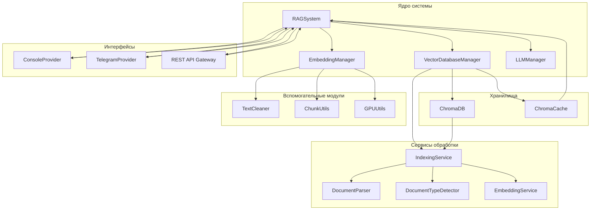
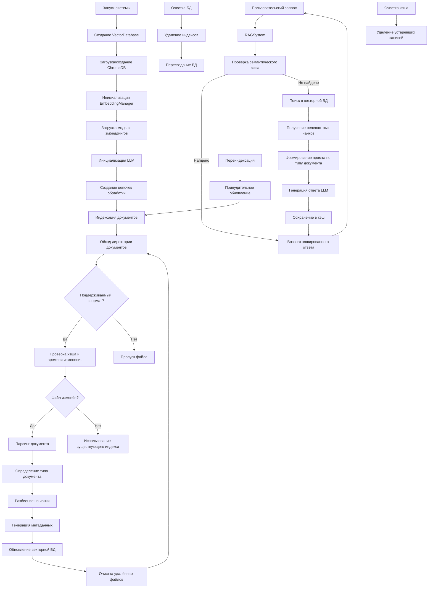

<!--  -->

---

### **Название проекта: RAG-Expert — Интеллектуальная система «Юридический консультант»**

---

### **1. Анализ потребностей и цели проекта**

Современные компании, особенно в юридической сфере, работают с постоянно растущим объёмом документов: контрактов, нормативных актов и внутренних регламентов. Это создаёт ряд критических проблем, или "болевых точек":

- **Ручной поиск**: Сотрудники тратят часы на поиск нужной информации, что приводит к потере времени и снижению продуктивности.
- **Низкая точность**: Поиск по ключевым словам не учитывает контекст и смысл запроса, что ведёт к неточным или неполным ответам.
- **Зависимость от экспертов**: Ключевые знания сосредоточены у нескольких сотрудников, что создаёт "узкие места" и риски при их отсутствии.
- **Риск ошибок**: Использование устаревших данных может привести к неверным решениям и финансовым потерям.
- **Отсутствие централизации**: Нет единой, всегда актуальной базы знаний для всей команды.

**Цель проекта** — внедрить интеллектуальную RAG-систему, которая автоматизирует поиск информации и предоставление консультаций, решая вышеуказанные проблемы.

- **Быстрое решение**: Запуск Telegram-бота для мгновенных консультаций на основе автоматической индексации существующих документов.
- **Долгосрочное решение**: Создание единой, масштабируемой платформы для работы со всеми корпоративными знаниями, с возможностью расширения на другие отделы (HR, финансы, медицина).

---

### **2. Уникальное торговое предложение (УТП)**

«Мы внедрим интеллектуальную RAG-систему, которая **сокращает время поиска информации с часов до секунд (в 5-10 раз)**, повышает **точность консультаций до 95%** и **высвобождает до 60% времени ваших специалистов** от рутинного поиска для решения более сложных задач. Система легко интегрируется в ваши текущие процессы и каналы общения без необходимости их перестройки».

**Наши сильные стороны:**

- **Универсальная платформа**: Модульная, многоагентная архитектура, легко адаптируемая под любую отрасль.
- **Многомодельность**: Поддержка ведущих LLM-провайдеров (OpenAI, GigaChat, Яндекс, Сбер) для выбора оптимального решения.
- **Высокая производительность**: Архитектура, оптимизированная для работы с GPU и в облачных средах.
- **Практический опыт**: Успешный опыт внедрения RAG-систем в юридической и бизнес-сферах.

---

### **3. Экономическая ценность и ROI**

Автоматизация обработки документов приносит измеримый финансовый результат.

**Пример расчёта для компании с 50+ сотрудниками и 10 000+ документов:**

- **Повышение продуктивности**: Экономия времени сотрудников на поиске информации высвобождает до **20%** рабочего времени, что эквивалентно экономии **\~2 млн руб./год** на фонде оплаты труда.
- **Улучшение клиентского сервиса**: Быстрые и точные ответы повышают лояльность клиентов, что может привести к росту повторных обращений на **15%** (до **+1,5 млн руб./год**).
- **Снижение рисков**: Уменьшение числа ошибок в консультациях позволяет избежать штрафов и потерь на сумму **\~500 тыс. руб./год**.

**Итог**: Потенциальная годовая выгода составляет до **4 млн руб.**. При стартовой стоимости проекта **500 тыс. руб.**, **ROI (возврат инвестиций) достигает 700%** уже в первый год.

---

### **4. Функционал проекта и этапы разработки**

#### **4.1. Высокоуровневая архитектура системы**

Система построена по модульной многоагентной архитектуре, что обеспечивает ее надежность, масштабируемость и простую интеграцию с новыми провайдерами и интерфейсами.

#### **4.2 Диаграмма логики работы системы**

Диаграмма логики работы системы показывает, как данные поступают в систему, какие действия выполняются и как они взаимодействуют друг с другом.

#### **4.3 Этапы разработки**

Проект реализуется поэтапно для быстрого получения ценности и постепенного наращивания функционала.

| Этап                                    | Основной функционал                                                                                                                                                                                               |
| :-------------------------------------- | :---------------------------------------------------------------------------------------------------------------------------------------------------------------------------------------------------------------- |
| **Этап 1 — MVP** _(4-6 недель)_      | • Индексация документов и семантический поиск. • Консультации через Telegram-бот и консоль. • Интеграция с базовой LLM (например, OpenAI). • Кэширование запросов для ускорения ответов.                 |
| **Этап 2 — Расширение** _(1–3 мес.)_ | • Интеграция с корпоративными системами (CRM, портал) и добавление веб-интерфейса. • Поддержка нескольких LLM-провайдеров. • Внедрение семантического кеша и модулей очистки данных для повышения качества. |
| **Этап 3 — Инновации** _(2–4 мес.)_  | • Продвинутая аналитика запросов пользователей. • Автоматическая генерация отчётов на основе данных из документов. • Масштабирование системы на кластер для обработки больших нагрузок.                     |

---

### **5. SWOT-анализ (для клиента после внедрения системы)**

- **Сильные стороны**: Экспертиза в домене, усиленная высокой скоростью и точностью поиска. Централизованная и всегда доступная база знаний.
- **Слабые стороны**: Необходимость в серверной инфраструктуре (рекомендуется GPU) или облачных ресурсах для оптимальной производительности.
- **Возможности**: Рост на рынке AI-консультаций. Масштабирование решения на другие отделы (HR, финансы). Улучшение взаимодействия с клиентами через боты.
- **Угрозы**: Появление аналогичных AI-инструментов у конкурентов. Риски утечки данных, которые минимизируются благодаря развертыванию системы в защищенном контуре клиента.

---

### **6. Дорожная карта и бюджет**

| Этап           | Срок         | Ориентировочная стоимость |
| :------------- | :----------- | :------------------------ |
| **MVP**        | 4 – 6 недель | 500 000 руб.              |
| **Расширение** | 1 – 3 мес.   | от 200 тыс. руб.          |
| **Инновации**  | 2 – 4 мес.   | от 100 тыс. руб.          |

- **Техническая поддержка**: 30–50 тыс. руб./мес. (опционально).
- **Инфраструктура**: Развертывание на сервере клиента или в облаке (дополнительные расходы на облако могут составить 10–20 тыс. руб./мес.).
